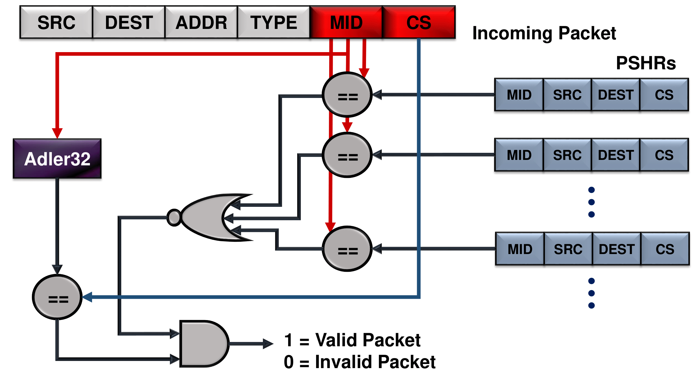

# HULK

## Securing Network-on-Chips Against Trojan-Induced Packet Duplication Attacks



## Setup
Clone repository
```shell
git clone https://github.com/itsmanju/hulk.git
```
## Build the HULK Framework
```shell
cd hulk
scons build/Garnet_standalone/gem5.fast -j33
```

## Run the HULK Framework
A sample gem5 simulation run
```shell
./build/Garnet_standalone/gem5.fast \
configs/example/garnet_synth_traffic.py \
--num-cpus=16 \
--num-dirs=16 \
--topology=Mesh_XY \
--mesh-rows=4 \
--network=garnet2.0 \
--sim-cycles=1000 \
--routing-algorithm=1
```
In the [scripts](scripts) folder you can find a useful shell scripts to run various simulations.

## Plot Results

In the [scripts](scripts) folder you can find useful shell scripts to gather results and plot them.

## Citation

To be updated.
